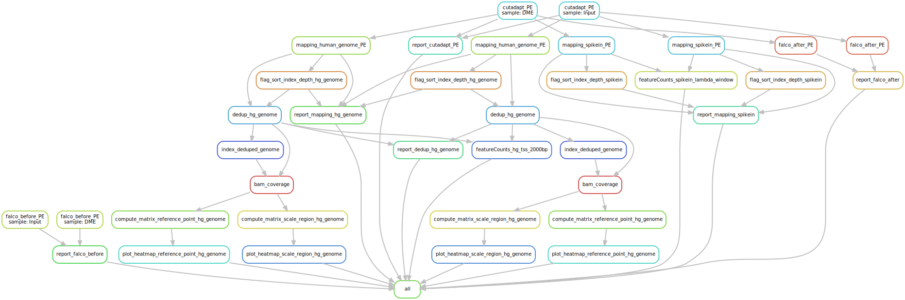

# DMN-seq Data Processing Pipeline

This repository contains comprehensive data processing workflows for DMN-seq (DNA methylation sequencing) analysis. The pipeline provides two distinct analytical approaches for methylation profiling:

1. **5mC Detection** (`5mC_detection/`) - Quantitative detection and analysis of 5-methylcytosine modifications
2. **Hypomethylation Enrichment** (`hypomethylation_enrichment/`) - Identification and characterization of hypomethylated regions

## Installation

### Prerequisites
- Python ≥3.7
- Snakemake workflow management system
- Mamba or Conda package manager

### Environment Setup

Create and activate the required environment:

```bash
# Using mamba (recommended)
mamba env create -f environment.yml
mamba activate dmnseq

# Or using conda
conda env create -f environment.yml
conda activate dmnseq
```

## Configuration

Before running the analysis, configure the pipeline parameters:

1. **Update workflow configuration**: Edit `config.yaml` in your chosen analysis directory
2. **Configure reference genome paths**: Specify genome assembly and annotation files
3. **Set software paths**: Update paths to required bioinformatics tools
4. **Prepare input data**: Place raw sequencing files in the `raw_data/` directory

Example configuration files are provided in each analysis subdirectory.

## Usage

### Option 1: Cluster Execution (Recommended for HPC)

The pipeline is optimized for SLURM-based high-performance computing environments (tested on University of Chicago Midway3 cluster):

```bash
cd hypomethylation_enrichment/  # or 5mC_detection/
snakemake --profile ../snakemake_config
```

**Note**: Modify `./snakemake_config/config.yaml` to match your cluster specifications.

### Option 2: Local Execution

For local analysis or smaller datasets:

```bash
cd hypomethylation_enrichment/  # or 5mC_detection/
snakemake --cores 12  # adjust core count as appropriate
```

## Workflow Overview

### Hypomethylation Enrichment Analysis
Identifies and analyzes regions with reduced methylation levels, suitable for:
- Hypomethylated region detection
- Differential methylation analysis
- Methylation landscape characterization



### 5mC Detection Analysis
Quantitative analysis of 5-methylcytosine modifications, optimized for:
- Single-base resolution methylation calling
- Quantitative methylation profiling
- Context-specific methylation analysis


## Output Structure

The pipeline generates structured output directories containing:
- Quality control reports
- Processed alignment files
- Methylation call files
- Statistical analysis results
- Visualization plots and summaries

## Contact
Yang Li (The University of Chicago)

## Support

For questions, issues, and comments, please refer to the repository's issue tracker or contact __Yang Li__ (yliuchicago@uchicago.edu).