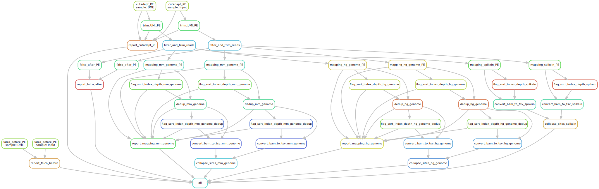

# DMN-seq

This is the repository for data processing of DMN-seq. There are generally two kinds of analysis for DMN-seq, one is the `5mC_detection/` and another is `hypomethylation_enrichment/`. I will use `hypomethylation_enrichment/` as an example.

First, install the environment using mamba or conda.

```bash
mamba env create -f environment.yml
```

To run the code, first update the `config.yaml` and `Snakemake` file to specify the reference genome and software path. Example files were included in `raw_data/`. Then run either of the following command:

1. Cluster execution.

Note that the snakemake config is used in Midway3 cluster of University of Chicago. You may need to modify the `./snakemake_config/config.yaml` file to fit your own environment.

```bash
cd hypomethylation_enrichment/
snakemake --profile ../snakemake_config
```

2. Run directly.

```bash
cd hypomethylation_enrichment/
snakemake --cores 12
```

The workflows are shown below:

1. Hypomethylation enrichment:


2. 5mC detection:

